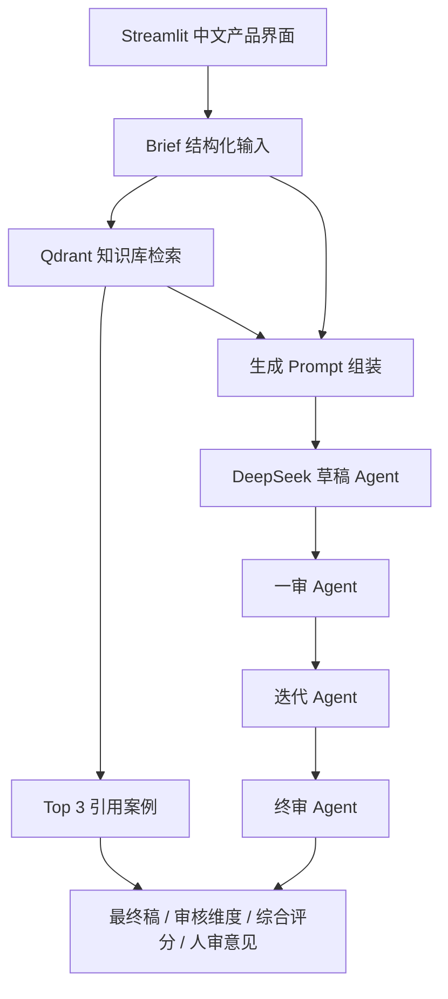

# 产品与技术架构

## 1. 总体架构

## 2. 模块拆分

| 模块 | 作用 |
|---|---|
| Streamlit UI | 提供可直接体验的中文产品界面 |
| Brief Builder | 将用户输入结构化为生成上下文 |
| Qdrant Retrieval | 检索历史案例、产品事实、合规规则和审核标准 |
| Draft Agent | 生成 Blog / EDM 初稿 |
| Review Agent | 按固定维度给出评分、问题和建议 |
| Revision Agent | 根据一审结果自动改稿 |
| Safety Rules | 过滤竞品词、虚构事实、绝对化和医疗化表达 |
| Evaluation Runner | 批量跑测试集并输出报告 |

## 3. 知识库设计

| 知识类型 | 示例 | 用途 |
|---|---|---|
| 历史案例 | Blog / EDM 案例 | 提供文案结构和表达参考 |
| 产品事实 | KeyX Pro 特性 | 约束事实边界 |
| 功能收益映射 | wireless -> cleaner desk | 帮助把功能转成用户收益 |
| 用户画像 | 远程办公、创作者、键盘爱好者 | 提高需求匹配 |
| 品牌语气 | 专业、有活力、高端 | 控制风格 |
| 合规规则 | 绝对化、医疗化、EDM 页脚 | 降低发布风险 |
| 审核标准 | 7 个固定维度 | 保持评估一致 |

## 4. Qdrant 使用方式

- `marketing_cases`: 历史 Blog / EDM 案例。
- `marketing_knowledge_base`: 产品事实、品牌规则、合规规则、审核标准等知识。
- 前台展示 Top 3 引用案例。
- 后台可合并案例库和知识库结果辅助生成。

## 5. 失败兜底

| 失败场景 | 兜底策略 |
|---|---|
| DeepSeek API 不可用 | 使用规则生成兜底内容 |
| Qdrant 不可用 | 使用内置参考案例 |
| Review Agent 返回非 JSON | 使用规则审核结果 |
| 生成内容出现风险词 | Safety Rules 自动清理 |

## 6. 安全边界

- API key 使用 Streamlit Secrets，不进入 GitHub。
- 页面不展示 API 输入框。
- 禁止输出竞品词。
- 禁止编造参数、保修、认证、用户评价、折扣和百分比效果。
- EDM 必须包含退订或偏好管理提示。
- 终稿仍需要人工复核，系统提供人审意见。
