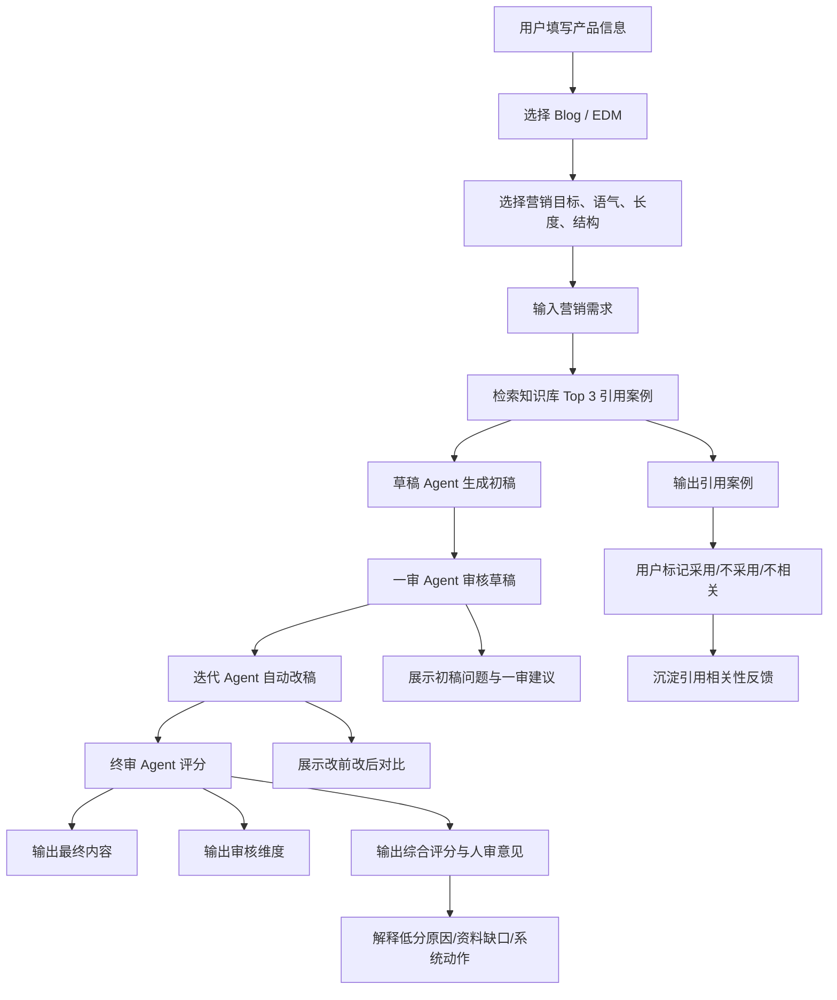
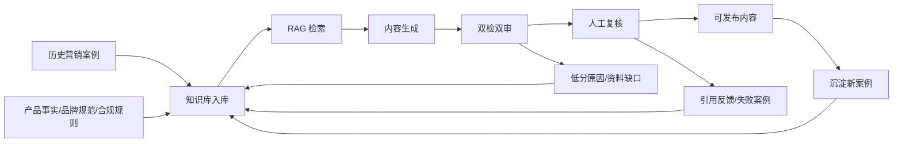

# 用户流程与业务闭环

## 1. 核心用户路径

## 2. 页面信息架构

| 区域 | 内容 | 产品意图 |
|---|---|---|
| 左侧配置栏 | 产品名称、产品特性、内容类型、附加提示词 | 固定产品上下文，减少主页面干扰 |
| 生成设置 | 营销目标、语气、长度、结构、避免出现的词 | 给用户必要控制权 |
| 输入区 | Blog / EDM 模板、营销需求 | 降低首次使用门槛 |
| 输出区 | 生成内容、引用案例、审核维度、综合评分 | 把结果、依据、审核和人审意见拆开展示 |
| 引用反馈 | 采用、不采用、不相关、反馈下载 | 让 RAG 引用从黑盒展示变成可干预数据 |
| 改稿对比 | 初稿问题、一审建议、终稿、提升维度 | 让双检双审过程可解释 |
| 低分解释 | 低分维度、原因、资料缺口、系统动作 | 把评分变成内容质量管理入口 |

## 3. 输出区为什么用四个 Tab

- 生成内容：用户第一关注点，默认展示。
- 引用案例：展示知识库依据，并允许用户反馈采用、不采用或不相关。
- 审核维度：展示固定质量标准，体现可控性。
- 综合评分：展示是否可发布、是否需要人工复核，并解释低分原因和下一步补充资料。

## 4. 双检双审的产品价值

| 阶段 | 目标 | 输出 |
|---|---|---|
| 草稿 Agent | 快速生成可读初稿 | draft_content |
| 一审 Agent | 找出风险和低分维度 | draft_scorecard |
| 迭代 Agent | 根据一审建议修正 | final_content |
| 终审 Agent | 对最终稿评分 | final_scorecard |
| 人审意见 | 给人工发布前复核重点 | human_review_notes |

页面需要让用户看到：初稿哪里有问题、一审建议如何驱动改稿、终稿相比初稿提升了哪些维度。

## 5. 低分原因解释

终审评分低于或等于 7 分的维度会进入低分解释区：

| 信息 | 作用 |
|---|---|
| 哪个维度低 | 帮用户定位质量问题 |
| 为什么低 | 说明当前内容的具体风险或缺口 |
| 要补什么资料 | 指向产品事实、案例、合规规则或渠道模板 |
| 系统下次怎么改 | 变成 Prompt、知识库或审核规则的迭代方向 |

## 6. 用户体验取舍

- 只保留 Blog / EDM，因为当前知识库覆盖度最高。
- 不展示 API 设置，避免面试官被技术配置打断。
- 审核维度不让用户选择，避免关闭关键审核。
- 引用案例只展示 Top 3，避免信息过载，但保留采用 / 不采用 / 不相关反馈入口。
- 专业词汇保留英文，例如 Blog、EDM、RAG、Qdrant、DeepSeek。

## 7. 完整业务闭环

